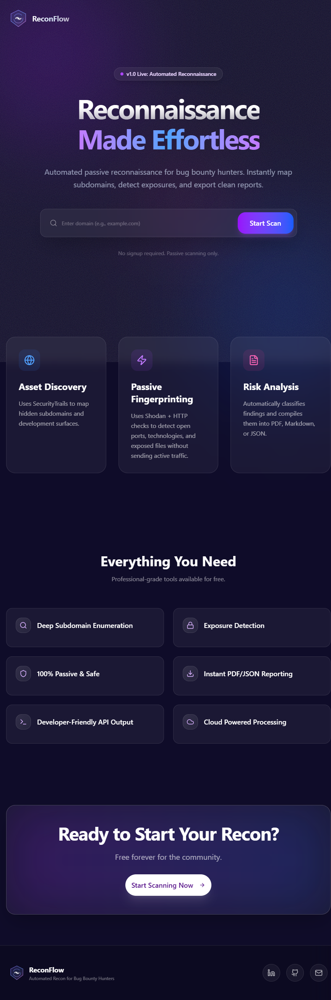
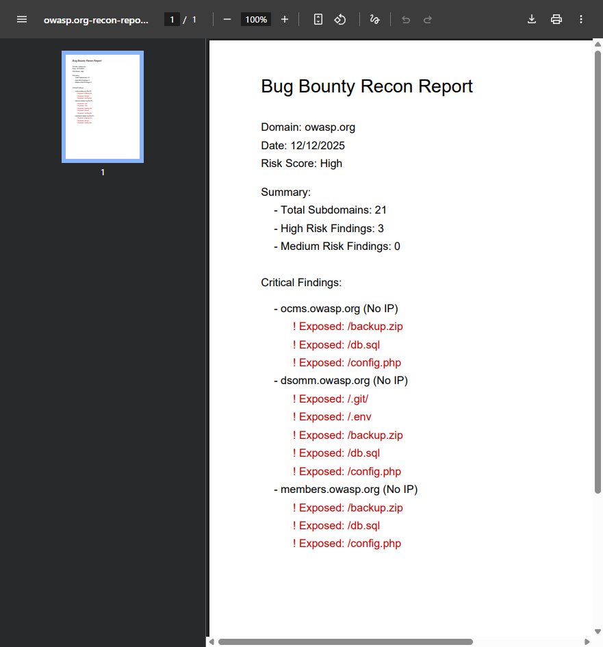
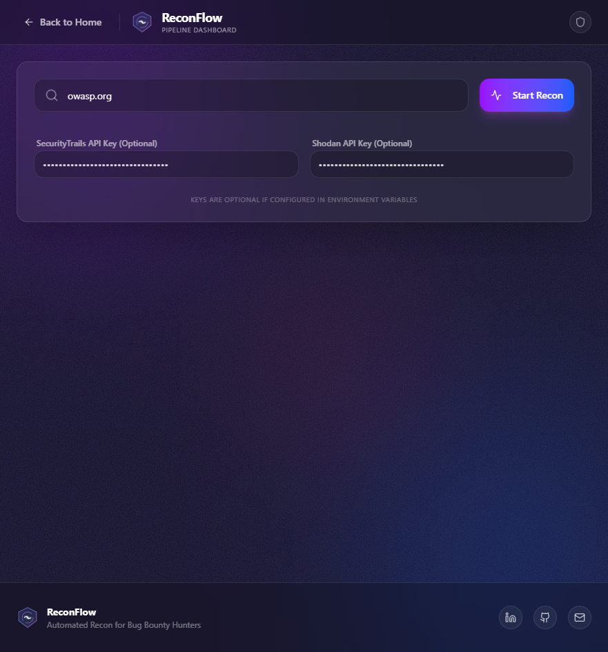
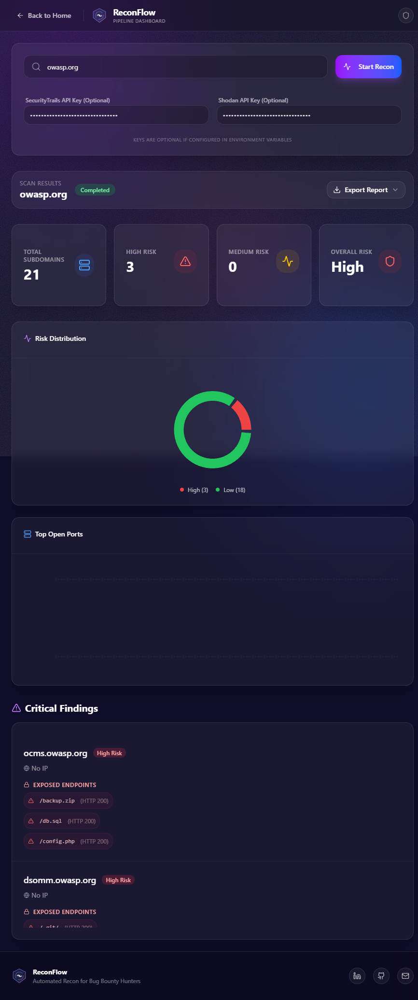
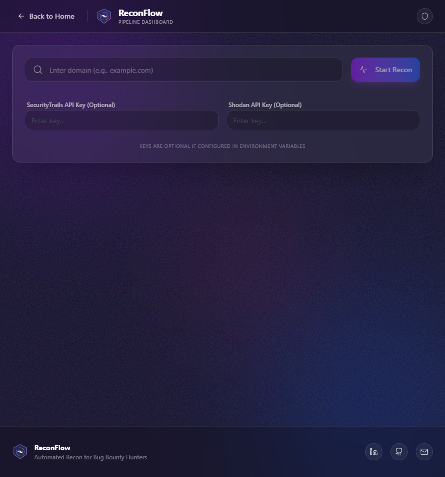
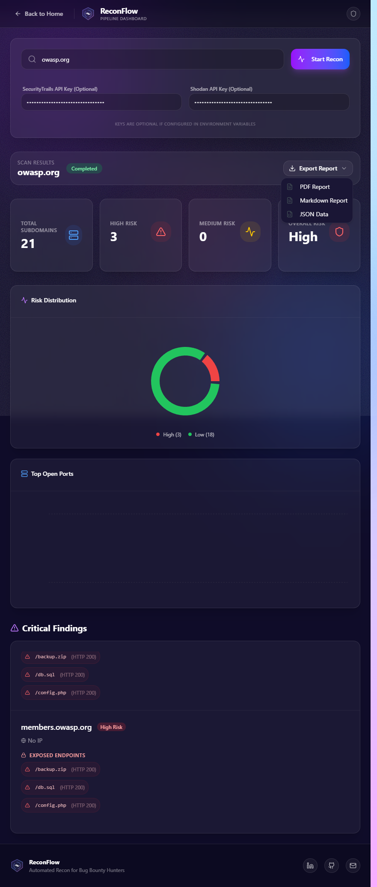

# ReconFlow

[](./LICENSE)
[](https://vitejs.dev/)
[](https://www.typescriptlang.org/)
[](https://reactjs.org/)

**ReconFlow** — Automated, passive reconnaissance and attack-surface mapping for bug-bounty hunters and security researchers.  
A focused, production-style tool for subdomain enumeration, passive fingerprinting, exposure detection, and professional reporting.


---

## Overview

ReconFlow is an opinionated, production-focused reconnaissance tool that:

- Performs passive subdomain enumeration (SecurityTrails)  
- Uses Shodan for passive port/tech intelligence (non-intrusive)  
- Detects exposed sensitive endpoints (`.git`, `.env`, `backup.zip`, DB dumps, etc.)  
- Aggregates results and generates downloadable reports (PDF / Markdown / JSON)  
- Presents results in a polished glassmorphism dashboard UI

This project is intended for use by security professionals and students for lawful reconnaissance and learning. See the **Security & Ethics** section below before use.

---

## Key Features

- **Passive subdomain enumeration** (SecurityTrails)  
- **Passive fingerprinting** (Shodan) — no active scanning or intrusive probes  
- **Exposure checks** for common sensitive files and endpoints  
- **Risk scoring** and prioritized findings list  
- **Export**: PDF, JSON, Markdown reports ready for sharing  
- **Modern UI**: glassmorphism, responsive design, animated components

---

## Tech Stack

- **Frontend:** React 19, TypeScript, Vite  
- **Styling:** Tailwind v4, ShadCN UI (component primitives)  
- **Animations:** Framer Motion  
- **Icons:** Lucide  
- **3D / Visuals:** Three.js (used for hero/visual effects)  
- **Backend & DB:** Convex (server & auth)  
- **APIs:** SecurityTrails, Shodan

---

## Quick Demo / Screenshots

### Home Page


### Report Preview


### Dashboard (Stats)


### Dashboard (Findings)


### Empty Dashboard State


### Search Input View



---

## How It Works (High-level)

1. User submits a domain via the web UI.  
2. ReconFlow calls SecurityTrails to fetch known subdomains.  
3. For each subdomain, ReconFlow queries Shodan for passive port/service fingerprints (if keys present).  
4. HTTP checks are performed for a list of sensitive endpoints (`/.git/`, `/.env`, `/backup.zip`, `/db.sql`, `/config.php`, etc.).  
5. Findings are aggregated, scored, and presented in the dashboard.  
6. User may export a PDF / JSON / Markdown report summarizing results and remediation recommendations.

---

## Getting Started (Local)

### Requirements

- Node.js 18+ (recommended)  
- pnpm (preferred) or npm/yarn  
- Modern browser for testing (Chrome / Edge / Firefox)  
- Optional: SecurityTrails & Shodan API keys (for full functionality)

### Install & Run

```bash
# clone
git clone https://github.com/LousyCake/ReconFlow-V1.git
cd ReconFlow-V1

# install dependencies (pnpm recommended)
pnpm install

# development server
pnpm dev

# build production bundle
pnpm build

# serve production locally (example)
pnpm preview
If your project does not include a Node toolchain, open index.html in the browser to preview static parts.

Environment Variables
Create a .env file in project root (do not commit real keys):

# Convex (if used)
VITE_CONVEX_URL=https://<your-convex-url>
CONVEX_DEPLOYMENT=<your-deployment-id>

# API Keys (optional but recommended)
SECURITYTRAILS_API_KEY=your_securitytrails_key
SHODAN_API_KEY=your_shodan_key
Also include .env in .gitignore to avoid leaking secrets.

Project Structure
pgsql
Copy code
ReconFlow/
├─ public/                  # public assets, images, favicon
├─ src/                     # application source (React, components, pages)
│  ├─ components/
│  ├─ pages/
│  ├─ convex/               # server functions, schema, auth (Convex)
│  └─ styles/
├─ index.html
├─ package.json
├─ pnpm-lock.yaml
├─ README.md
└─ .gitignore
```
---
## API Integrations & Usage

### SecurityTrails
- Purpose: subdomain enumeration

- Endpoint example: `https://api.securitytrails.com/v1/domain/{domain}/subdomains`

- Use the `SECURITYTRAILS_API_KEY` environment variable.

### Shodan
- Purpose: passive service/port information (no scanning)

- Use Shodan hostname/IP endpoints to lookup already-discovered assets.

- Use the `SHODAN_API_KEY` environment variable.

Important: All calls are **passive** — ReconFlow does not perform active network scanning. This avoids triggering WAFs and reduces **legal risk.**

---
## Exporting Reports
- PDF reports are generated server-side / browser-side (depends on build).

- Export formats: **PDF, Markdown, JSON.**

- Reports include quick summary, critical findings grouped by subdomain, and suggested remediation steps.

Example export actions are available on the dashboard as an “Export Report” dropdown.

---
## Deployment Options
Choose one of the following:

- **Vercel** — connect GitHub repo, auto-deploy branch `main`.

- **Netlify** — link repo and configure build (`pnpm build` / `pnpm preview`).

- **GitHub Pages** — for static-only deployments (no server functions).

- **Cloud (Convex)** — if backend functions are needed, configure Convex deployment & environment.

When deploying to Vercel/Netlify, add the required environment variables in the project settings.

---
## Configuration & Customization
- **Change theme / colors:** `src/index.css` (Tailwind variables / Oklch colors)

- **Update detection patterns:** modify the exposures list in the scanning module (search for `sensitive_endpoints` or similar)

- **Add additional API providers:** add a new integration module and wire it in the pipeline

---
## Security & Ethics
- **Only run ReconFlow against domains you own or have explicit permission to test.**

- ReconFlow is configured for **passive reconnaissance.** It intentionally avoids active scans.

- Misuse of reconnaissance tools may be illegal — always check target’s policy and local laws.

- Never publish or exploit identified secrets; responsibly disclose findings to the asset owner.

---
## License
This project is licensed under the MIT License. See the included `LICENSE` file for details.

---
## Contact & Portfolio Blurb
**Author:** Anshul Shukla (LousyCake)

- LinkedIn: https://www.linkedin.com/in/nshul17

- GitHub: https://github.com/LousyCake

- Email: nshul.shukla@gmail.com

---
